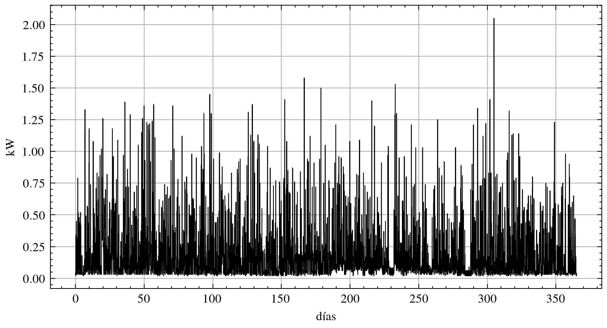

<!-- _color: white -->

# Trabajo de Fin de Máster
###  Máster Universitario en Ingeniería de la Energía

Optimización energética de sistema híbrido con bomba de calor, suelo radiante, fotovoltaica y almacenamiento para vivienda

---

## E14004 (Luis D. Aranda)

* Grado en Ingeniería de la Energía (2010-2016)
* Máster en Ingeniería de la Energía (2016-2017)
* TFM pendiente
* Trabajo haciendo páginas web (2018-presente)
* Última oportunidad para realizar TFM (2024)

<!--

Hola, soy Luis Domingo Aranda, estudiante E14004.
extrañamente aún me acuerdo del numerito y me parecía gracioso ponerlo.

Hice el grado de energía, con los dos últimos cursos en Industriales.

Luego pasé a hacer el máster, y aquí cometí el error de dejarme el TFM
pendiente, en su momento pensaba que mientras tuviera alguna asignatura
de la que matricularme aún seguiría siendo estudiante y con eso podría
conseguir alguna beca o prácticas en empresa, y meter cabeza.

Pero estuve unos 3 meses buscando, no encontré nada, y al final
pasé a buscar trabajo de programador, y casi que inmediatamente
empecé a trabajar de eso.

Así que llevo desde 2018 haciendo páginas web en una consultora,
principalmente para un banco, caja rural.
y llevo allí a lo tonto ya más de 6 años.

Y solo ahora me lancé a tratar de terminar el trabajo, cuando
desde secretaría recibí un ultimatum, porque esta es la última
convocatoria para la versión del máster de la energía que cursé,
que se va a descontinuar.

-->

---

### Optimización energética de sistema híbrido con bomba de calor, suelo radiante, fotovoltaica y almacenamiento para vivienda

<!--

Entonces este TFM se titula
'Optimización energética de sistema híbrido con bomba de calor, suelo radiante, fotovoltaica y almacenamiento para vivienda'
en forma de baterias y un deposito de agua caliente.

y el objetivo será minimizar el coste por operar esta
instalacion que tiene unas necesidades de electricidad y calor,
como cualquier casa.

en el problema de Optimización tendremos
unas variables de diseño, que pueden ser
de control, como por ejemplo,
si en un instante dado queremos comprar o vender
electricidad, o si queremos almacenar o extraer
energia de las baterias, y tambien
podremos elegir las dimensiones de los equipos.
Como cuantos paneles solares debemos de instalar,
o como de grandes deben de ser las baterias o la
bomba de calor.

-->

---

### Qué no?

- Paneles solares térmicos
- Aire acondicionado
- Modelización de los componentes de la bomba de calor

---

### Qué sí?

- Optimización de control y dimensionamiento restringido por un sistema DAE
- Para todo un año
- 300000 variables de diseño

---

### Vamos a ver

- Metodología de optimización
- Datos de entrada (precios, meteorología, costes)
- Modelización del sistema, ecuaciones
- Control y dimensionamiento óptimos

---

# Metodología

---

<!-- 

Y aqui en metodologia, empiezo mostrando el tipo de problema 
que me tiene fascinado, y durante la carrera alguna vez veia,
pero nunca llegue a saber como funcionaba.
y es la optimizacion restringida por ecuaciones en derivadas parciales.

aquí podemos ver una optimización topológica, que tipicamente
busca minimizar el compliance.
o una optimizacion de la forma de un perfil, acoplando simulaciones
estructurales con simulaciones de cfd para maximizar la relacion entre
la sustentacion y la resistencia aerodinamica.

es un problema de optimización, sí, pero de alguna forma hace uso
del resultado de simulaciones con elementos finitos, o volumenes
finitos. cómo?

-->

$$
\begin{aligned}
  & \underset{\boldsymbol{\rho}}{\text{minimizar}} \quad & C(\boldsymbol{\rho}) &= \mathbf{f}^\top \mathbf{u}(\boldsymbol{\rho}) \\
  & \text{sujeto a} \quad & \mathbf{K}(\boldsymbol{\rho}) \mathbf{u}(\boldsymbol{\rho}) &= \mathbf{f}, \\
  & & \frac{1}{N} \sum_{i=1}^{N} \rho_i &\leq V^*, \\
  & & 0 \leq \rho_i &\leq 1, \quad \forall i = 1, \ldots, N.
\end{aligned}
$$

---

# Datos (2022)

---

## Precios y consumo

- esios.ree.es
- omie.es

---

## Temperatura ambiente y producción solar

- Madrid
- nsrdb.nrel.gov/data-viewer
- sam.nrel.gov

--- 

## Costes

- Paneles: 1,16[€/W]
- Baterías LiFePO4
- Bomba de calor
- Depósito de agua
- Generador diesel

---

# Modelización

---

### Vivienda modelo

- $100[m^2]$ techo plano
- $100[m^2]$ de fachada, de los cuales $25[m^2]$ ventanas
- **Restricción**: mantener la temperatura siempre por encima de los 20ºC

---

### Esquema eléctrico

<!--

este seria el esquema eléctrico de la vivienda.

Que tiene unos paneles solares montados en el tejado.

un controlador de seguimiento de maxima potencia, que basicamente
consiste en un convertidor de electronica de potencia
que regula la tension de salida de los paneles para producir
el maximo de potencia.

Unas baterías,

un convertidor bidireccional continua/alterna,

una carga, que es la demanda eléctrica del hogar,

potencia destinada a la bomba de calor que nos proporciona calefaccion,

y conexión a red.

-->

---

### Esquema térmico

<!--

el esquema térmico, es algo más complejo, pero tampoco
tiene mucho más.

primero tenemos la bomba de calor compuesta por compresor,
condensador, valvula de laminacion y evaporador.

en este circuito tienes un refrigerante como puede ser el rs-32,
y al comprimir el gas se calienta, podemos extraer su calor
con un condensador, que es intercambiador de calor donde
se da el cambio de fase del refrigenrante de estado gaseoso a estado
liquido, y a continuacion al estrangularse en una valvula
de laminacion para reducir su presion, y por tanto su temperatura.
reduciendo la temperatura por debajo de la ambiente, permite que podamos
extraer calor del el.
el evaporador es otro intercambiador
de calor como el condensador, pero aqui el refrigenrante cambia
de estado liquido a gaseoso. al irse calentando se va evaporando.

funciona como un frigorifico, pero en el frigorifico queremos
enfriar nuestros alimentos, aqui estamos realmente enfriando la calle,
extrayendo calor de la calle.
en caso de aerotermia, hariamos circular aire a traves del evaporador con un ventilador
para tener conveccion forzada.

y en el frigorifico el calor se desecha por su parte de atras del electrodomestico,
pero en una bomba de calor el calor emitido no es un residuo, sino 
el producto principal que utilizamos para calentar un circuito de agua,
que corresponderia a este bucle (señala).

por aqui sacamos agua del tanque a temperatura T_tanque
y lo hacemos circular usando esta bomba de circulacion
a traves del condensador para elevar su temperatura hasta T_cond
de salida del condensador.

por último tenemos otro circuito, donde extraemos del tanque de agua,
y circulamos con otra bomba a través del suelo radiante para calentar
la vivienda.
la temperatura de salida del agua seria T_cale de calefaccion.

-->

---

# Optimización

---

<!--

aquí tenemos los dos sistemas juntos, y marcamos
en rojo los equipos que podemos controlar, y en azul
los elementos que podemos dimensionar.

porque vamos a hacer una Optimización conjunta de ambos.

partiendo de los paneles fotovoltaicos,
no consideramos que los podamos controlar, sino que
producen una potencia dada por la radiacion solar que tengamos
en ese momento del dia. pero sin embargo podemos dimensionar, y decidir
cuantos paneles queremos.

luego la bateria la podemos dimensionar, elegir que capacidad
queremos. más grande, más pequeña? más cara, más barata? también.
y podemos a cada instante controlar cuanta potencia extraer o almacenar
en la bateria.
parece logico que cuando tenemos exceso de produccion solar, y el precio
de la luz esta bajito, querremos almacenar este excedente, y venderlo
cuando el precio suba algo mas.
o aunque no tengamos exceso de produccion, podriamos comprar energia por
la noche que esta barata la luz, y revender por el dia que esta cara.
especular ahi de alguna forma.

luego, cuando aqui ponemos que estamos mandando energia la bomba de
calor, nos referimos a que estamos mandando potencia al compresor de
la bomba de calor. de ahi esta flechita que relaciona estos dos elementos.

y vemos que el compresor, lo podemos controlar,
ponerlo a mas o menos potencia de funcionamiento, para extraer mas
o menos calor del ambiente, y lo podemos dimensionar. elegir si
queremos comprar un compresor mas o menos potente.
que tambien el resto de componentes de la bomba de calor deberan
ir acordes al compresor.

de nuevo en el sistema electrico, la red electrica, aquí
podemos elegir qué potencia maxima queremos contratar con
la comercializadora. que seria como un dimensionamiento de
la red. e influye principalmente en el termino fijo
de la factura de la luz.

luego tambien podemos elegir el volumen del tanque de agua.

y por ultimo, como variables de control
los caudales de las bombas de circulacion hacia el condensador
y hacia el suelo radiante.

-->

---

# Planificación y presupuesto

---

- 300 horas divididas en 5 fases de ejecución

- Coste correspondiente al sueldo medio de un ingenierio junior en energías renovables (guía salarial adecco 2024).

$$
28000 \left[\frac{\text{€}}{\text{año}} \right] \cdot  \frac{1}{52} \left[\frac{\text{año}}{\text{semana}}\right] \cdot \frac{1}{40} \left[\frac{\text{semana}}{\text{hora}}\right]  = 13.46 \left[\frac{\text{€}}{\text{hora}}\right]
$$

$$
300 [\text{hora}] \cdot 13.46 \left[\frac{\text{€}}{\text{hora}}\right] = 4038 [\text{€}]
$$

---

## Conclusiones

- Modelo imperfecto
- Éxito en la aplicación de la metodología

  Apropiada para problemas de diseño de gran escala, restringidos por ecuaciones en derivadas parciales o sistemas dinámicos

---

# <!--fit--> Dudas? :thinking:
